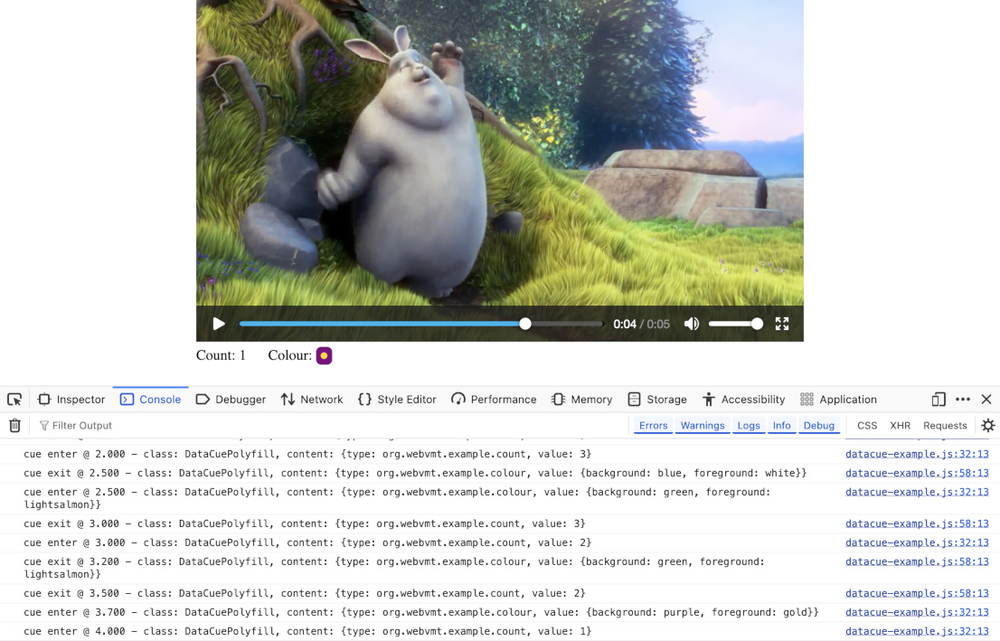

# vmt-sync-examples

## Overview

These examples show how timed metadata can be synchronised with video using the [WebVMT sync command](https://www.w3.org/TR/webvmt/#synchronized-data) and accessed with [DataCue](https://wicg.github.io/datacue/#datacue-interface) or a custom [TextTrackCue](https://developer.mozilla.org/en-US/docs/Web/API/TextTrackCue) in a web page

  
_DataCue example web page with console log_

### Data types

Example code focuses on a video synchronised with two disparate types of timed metadata:

 * `count` cues which contain a single number
 * `colour` cues which contain a structured object with `foreground` and `background` attributes

### <a id='code-design'></a>Code design

The basic design to access timed metadata in a web page using WebVMT is:

 1. Read synchronised data cues from a VMT file.
 1. Create a `DataCue` or custom `TextTrackCue` for each cue.
 1. Attach `enter` and `exit` handlers to each cue.
 1. Add all these cues to `TextTrack` to synchronise them with a video.
 1. Process timed data using event handlers.

 ```mermaid
 graph TD
    A(VMT file) --> |Parse| B
    B("WebVMT sync
    commands") --> |Create| C
    C(DataCues) --> |"Add event
    handlers"| E
    B --> |Create| D(Custom cues)
    D --> |"Add event
    handlers"| E
    E("Cues with
    handlers") --> |Add| F
    F(TextTrack) --> |Cue events| G
    G(Event handlers)
 ```

#### Example

In this example, `count` and `colour` cues are delivered by a single track using `DataCue`.

 * [DataCue example](https://webvmt.github.io/vmt-sync-examples/datacue.html)

## Code variations

Each variation is based on the [basic design above](#code-design), but demonstrates how a single additional feature can be integrated with this design. Many variations can produce the same net result as the basic design, though underlying differences can be observed in the `console.log` output.


Code variations are:

 1. [Streaming cues](#streaming) for live streaming
 1. [Custom cues](#custom-cues) for tailored access
 1. [Duplicate cue types](#duplicate-types) to distinguish similar data streams
 1. [Multiple tracks](#multiple-tracks) to merge data streams
 1. [Multiple handlers](#multiple-handlers) that independently process the same data stream
 1. [Track events](#track-events) for cue change responses

### <a id='streaming'></a>Streaming cues

Live streaming use cases can include cues with a known start time and content, but an _unknown_ end time - which may become known in the future. These [unbounded cues](https://html.spec.whatwg.org/multipage/media.html#unbounded-text-track-cue) can be represented in a VMT file by omitting the cue end time.

Unbounded cues can be overridden by a later cue of the same type as shown in the [streaming.vmt file](vmt/streaming.vmt). This file produces the same net result as the bounded cues in the [mixed.vmt file](vmt/mixed.vmt), but without referring to any _future_ time.

#### Example

In this example, bounded cues are replaced with unbounded cues, so no cue refers to a future time.

 * [Streaming example](https://webvmt.github.io/vmt-sync-examples/streaming.html)

### <a id='custom-cues'></a>Custom cues

Custom cues can be used to define cue content and functions with which to access content for a particular use case. For example, a geographical location cue may include functions to return speed and distance travelled.

All cues must be derived from `TextTrackCue` in order to integrate with `TextTrack`. `DataCue` and `VTTCue` are examples of cues for timed data and timed text respectively. [Users may define their own custom cues](https://html.spec.whatwg.org/multipage/media.html#guidelines-for-exposing-cues-in-various-formats-as-text-track-cues) derived from either of these classes, or directly from `TextTrackCue` using a [polyfill](polyfills).

#### Example

In this example, `count` and `colour` cues are delivered using custom `CountCue` and `ColourCue` classes instead of `DataCue`. Custom cue definitions can be found in the [custom-cues directory](custom-cues).

* [Custom cue example](https://webvmt.github.io/vmt-sync-examples/custom-cue.html)

### <a id='duplicate-types'></a>Duplicate cue types

Multiple data streams of the same type may need to be distinguished. For example, a theatre or music venue may include several stage lights of the same type which need to be controlled independently of each other for a live screening event.

Cue types should contain sufficient detail to allow proper identification and interpretation of timed metadata. The following example displays two discrete counts which are identified and handled correctly.

#### Example

In this example, `colour` cues are replaced by a second `count` stream which does not interfere with the first.

* [Multiple count example](https://webvmt.github.io/vmt-sync-examples/multi-count.html)

### <a id='multiple-tracks'></a>Multiple tracks

Data from multiple VMT files can be merged into a single VMT file without any penalty, though there may be reasons why this is impractical. For example, data from discrete sources may need to be retained in their original form to preserve integrity as admissible evidence.

#### Example

In this example, `colour` and `count` cues are read from two discrete VMT files by two discrete tracks which are both synchronised with the same video.

* [Multiple track example](https://webvmt.github.io/vmt-sync-examples/multi-track.html)

### <a id='multiple-handlers'></a>Multiple handlers

Data may be processed for different purposes by discrete event listeners that are agnostic of each other. Handler code written by different developers may appear in the same web page and process data cues from the same video. For example, geotagged video may be processed by a page to provide location services and by advertisers on that page to personalise content.

#### Example

In this example, `colour` and `count` cues are processed separately by two discrete cue handlers that are agnostic of each other.

* [Multiple handler example](https://webvmt.github.io/vmt-sync-examples/multi-handler.html)

### <a id='track-events'></a>Track events

A `TextTrack` generates a `cuechange` event whenever the active state changes for at least one of its cues. This event includes a list of active cues for that track, though does not identify which cues changed.

Track events offer an alternative to cue events that may be better suited to certain use cases for reasons of response or efficiency. For example, a system may only need to know which cues are currently active, rather than tracking their individual transitions. In addition, processing a group update may be more efficient when many cues change concurrently, such as a stage lighting change for a live screening event.


The best choice of event type may depend on the processing action rather than the cue content. For example, track events are well-suited to displaying musical notes when their cues are active, but cue events are better suited to playing musical notes because action must be taken to start and stop their audio playback.

#### Example

In this example, `colour` and `count` cue updates are triggered by any change in the active cue states.

* [Track events example](https://webvmt.github.io/vmt-sync-examples/datacue-change.html)

#### Comparison of cue and track events

The table below allows comparison of the previous cue event examples with their track event equivalents. Each pair of examples use identical JavaScript source files, though connect different event handlers in their `init` routines.

| Example | Track event | Cue event |
| --- | --- | --- |
| DataCue | [DataCue (track)](https://webvmt.github.io/vmt-sync-examples/datacue-change.html) | [DataCue (cue)](https://webvmt.github.io/vmt-sync-examples/datacue.html) |
| Streaming | [Streaming (track)](https://webvmt.github.io/vmt-sync-examples/streaming-change.html) | [Streaming (cue)](https://webvmt.github.io/vmt-sync-examples/streaming.html) |
| Custom cue | [Custom cue (track)](https://webvmt.github.io/vmt-sync-examples/custom-cue-change.html) | [Custom cue (cue)](https://webvmt.github.io/vmt-sync-examples/custom-cue.html) |
| Multiple count | [Multiple count (track)](https://webvmt.github.io/vmt-sync-examples/multi-count-change.html) | [Multiple count (cue)](https://webvmt.github.io/vmt-sync-examples/multi-count.html) |
| Multiple track | [Multiple track (track)](https://webvmt.github.io/vmt-sync-examples/multi-track-change.html) | [Multiple track (cue)](https://webvmt.github.io/vmt-sync-examples/multi-track.html) |
| Multiple handler | [Multiple handler (track)](https://webvmt.github.io/vmt-sync-examples/multi-handler-change.html) | [Multiple handler (cue)](https://webvmt.github.io/vmt-sync-examples/multi-handler.html) |
